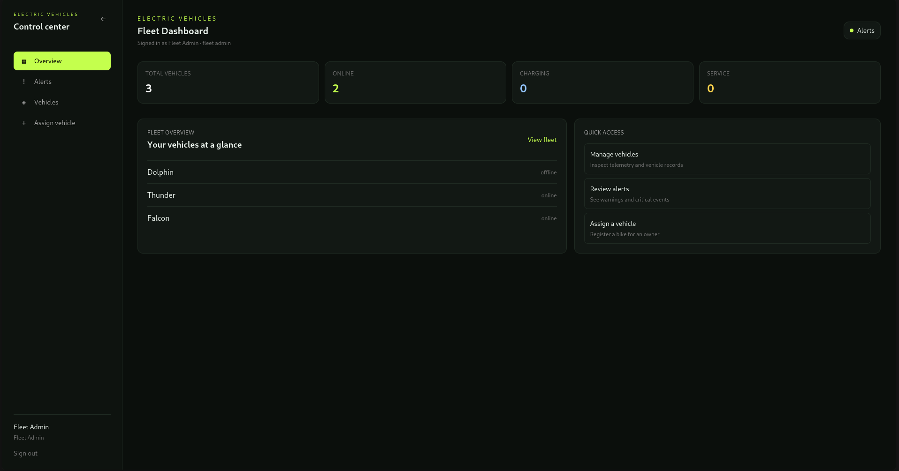
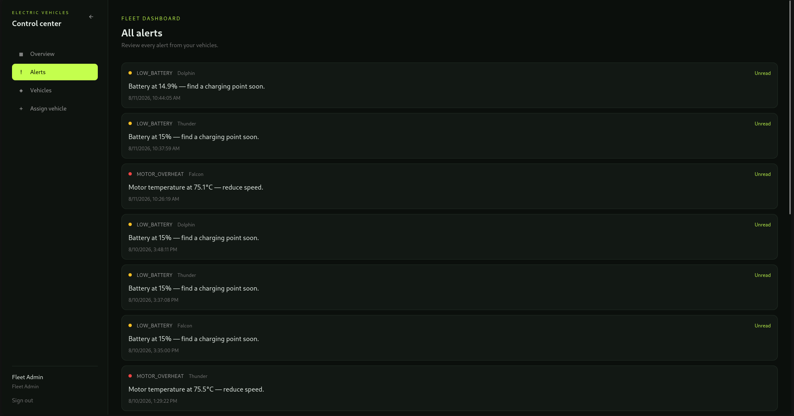
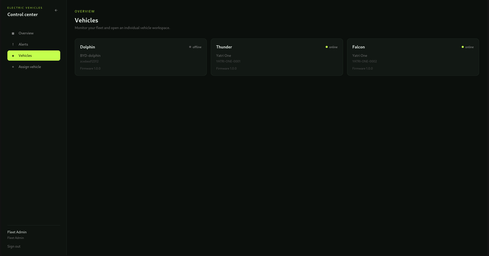
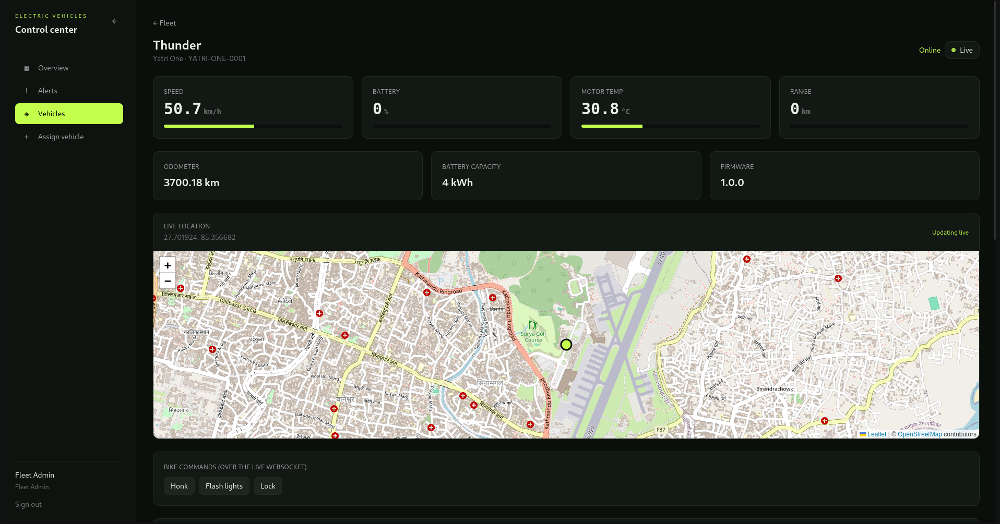
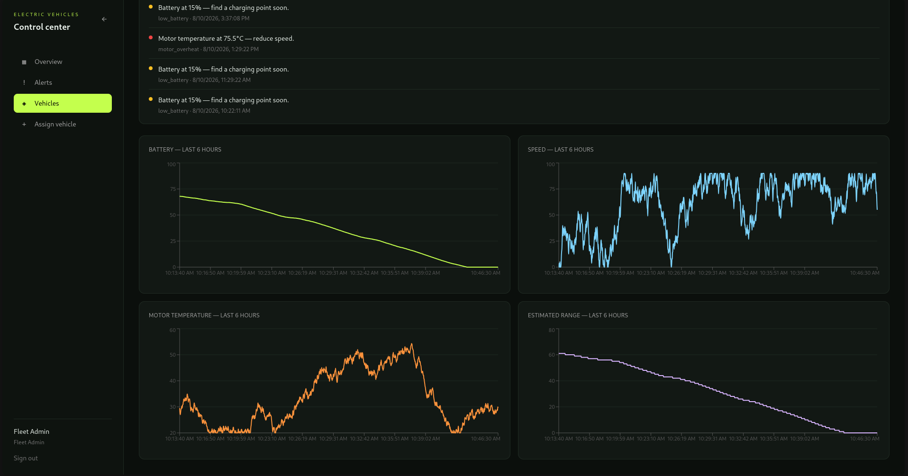
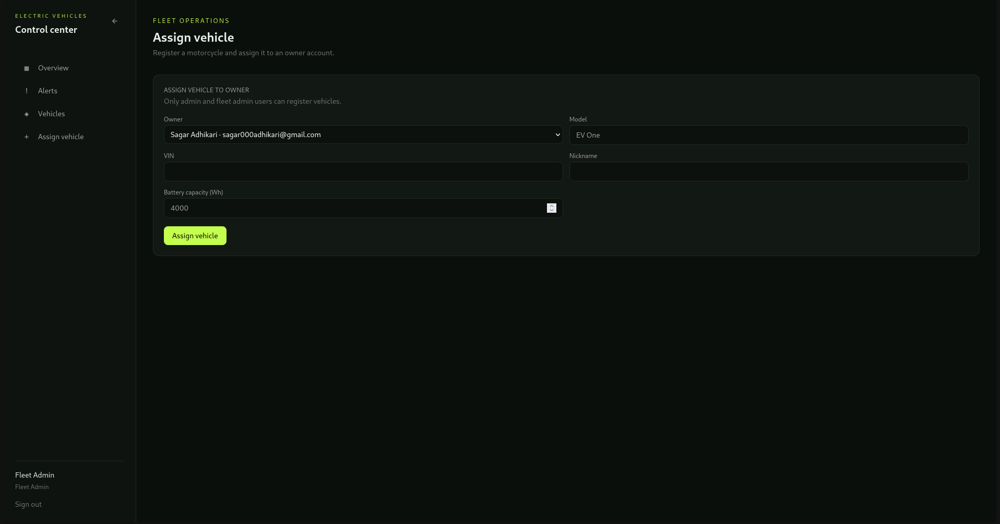

# EV Fleet Dashboard

A full-stack reference project: **Node.js/Express + MySQL** backend with a
**Next.js** dashboard, built to teach the exact skills in the EVs Node.js Software Engineer— REST API design, database
schema design, WebSockets, Server-Sent Events, and JWT auth between
systems.

Tested end-to-end in a clean environment: MySQL schema loads, seed script
runs, REST auth flow works, WebSocket live telemetry + bidirectional
commands work, and the SSE alert stream works. The Next.js frontend
builds with zero errors.

## Dashboard screenshots

### Fleet overview

The overview screen gives fleet administrators a quick summary of total,
online, charging, and service vehicles. It also provides shortcuts to manage
vehicles, review alerts, and assign a new vehicle.



### Alerts

The alerts screen lists vehicle events such as low battery and motor
overheating. Each alert shows its severity, vehicle, message, timestamp, and
read status.



### Vehicle list

The vehicle list shows the vehicles available to the signed-in user, along
with each vehicle's online status, model, VIN, and firmware version.



### Vehicle detail and live map

The vehicle detail view displays live speed, battery, motor temperature, range,
odometer, battery capacity, firmware, and GPS coordinates. The map marker is
updated from the vehicle's live telemetry stream, and the page also exposes
vehicle commands such as honk, flash lights, and lock.



### Telemetry history

Historical charts show battery level, speed, motor temperature, and estimated
range over the last six hours. This helps users understand recent vehicle
performance instead of relying only on the current reading.



### Vehicle assignment

Fleet administrators can register a vehicle by selecting an owner and entering
the model, nickname, VIN, and battery capacity.



```
ev-dashboard/
├── backend/           Express API + WebSocket server + SSE + MySQL
│   └── src/
│       ├── app.js             Express app (REST routes, middleware)
│       ├── server.js          HTTP server entry — wires WS onto the same port
│       ├── config/db.js       mysql2 connection pool
│       ├── config/redis.js    Redis current-state storage
│       ├── config/telemetryStore.js  MySQL/Timescale history adapter
│       ├── db/schema.sql      Full MySQL schema
│       ├── db/seed.js         Demo user + 2 vehicles
│       ├── middleware/auth.js JWT verification (header + query-param variants)
│       ├── routes/            auth.js, vehicles.js, alerts.js
│       ├── websocket/         eventBus.js, server.js  (live telemetry)
│       ├── sse/events.js      Server-Sent Events endpoint (alerts)
│       └── simulator/         Fake bike generating live telemetry + alerts
└── frontend/           Next.js 14 (App Router) + Tailwind + Recharts
    └── src/
        ├── app/                login, dashboard, vehicle/[id] pages
        ├── components/         Gauge, VehicleCard, NotificationFeed
        └── lib/
            ├── api.js              REST client
            ├── useLiveTelemetry.js WebSocket hook (manual reconnect/backoff)
            └── useAlertStream.js   SSE hook (EventSource, auto-reconnect)
```

---

## 1. Run it yourself

### Backend
```bash
cd backend
cp .env.example .env        # edit DB_PASSWORD etc.
npm install
mysql -u root -p < src/db/schema.sql
mysql -u root -p < src/db/migrations/002_add_telemetry_hourly.sql
npm run seed                # creates demo@evmotorcycles.com / password123
npm run dev                 # http://localhost:4000
```

### Frontend
```bash
cd frontend
cp .env.local.example .env.local
npm install
npm run dev                 # http://localhost:3000
```

Log in with `demo@evmotorcycles.com` / `password123`. Two demo bikes
("Thunder" and "Falcon") stream fake but realistic telemetry the moment
the backend starts — no hardware needed.

---

## 2. Architecture, end to end

```
                         ┌────────────────────────────┐
                         │   telemetrySimulator.js     │  (stand-in for
                         │   generates speed/battery/  │   real bikes —
                         │   temp/GPS every ~1.5s      │   swap for MQTT
                         └──────────────┬───────────────┘   later)
                                        │ emits on a shared EventEmitter
                          ┌─────────────┴─────────────┐
                            ▼                            ▼
                            ┌───────────────────────┐    ┌───────────────────────┐
                            │   Redis current state  │    │   MySQL alert events   │
                            │ vehicle:{id}:current   │    │   relational source     │
                            └───────────┬───────────┘    └───────────────────────┘
                            │
                            ▼
                         GET /api/vehicles/:id/current

                           ┌───────────────────────┐
                           │ MySQL telemetry history│
                           │ periodic snapshots     │
                           └───────────────────────┘

                            ▼                            ▼
                 'telemetry' event              'alert' event
                          │                            │
                          ▼                            ▼
              ┌───────────────────────┐    ┌───────────────────────┐
              │  WebSocket server      │    │  SSE endpoint          │
              │  /ws/live               │    │  /api/events/stream    │
              │  rooms per vehicleId    │    │  text/event-stream     │
              └───────────┬─────────────┘    └───────────┬─────────────┘
                          │ ~every 1.5s, ephemeral         │ only on threshold events
                          ▼                                ▼
                  Browser: useLiveTelemetry          Browser: useAlertStream
                  (raw WebSocket + manual             (native EventSource,
                   reconnect/backoff)                  auto-reconnects)

  Redis stores the freshest reading -> served over REST for
  current-state queries (GET /api/vehicles/:id/current).
  Telemetry history is configurable: MySQL by default, or TimescaleDB
  when TELEMETRY_STORE=timescale. Both are served through
  GET /api/vehicles/:id/history.
```

The important design decision here — and the one the JD is really
testing for — is **not defaulting to WebSockets for everything**.
Two different transports were picked for two different data shapes:

| | WebSocket | SSE |
|---|---|---|
| Direction | Bidirectional | Server → client only |
| Used for | Live telemetry (speed, battery, GPS, temp) | Alerts/notifications (low battery, overheat, geofence) |
| Frequency | High (every ~1-2s) | Low (only when something happens) |
| Transport | Own protocol (`ws://`), needs an HTTP "Upgrade" | Plain HTTP, works through any proxy that handles regular HTTP |
| Reconnect | You write it yourself | Built into the browser's `EventSource` |
| Can survive missed events | No — if disconnected, data is just gone until reconnect | Yes — `id:` + `Last-Event-ID` let the server resume |
| Extra capability | Client can send messages back (e.g. "honk horn") | None — one-way by design |

---

## 3. WebSocket, explained through this code

**Backend — `src/websocket/server.js`**

1. A raw `http.Server` (in `server.js`) is shared by Express *and* the
   WebSocket server. WebSockets start life as a normal HTTP request with
   an `Upgrade: websocket` header; Node's `http.Server` emits an
   `'upgrade'` event for these instead of routing them through Express.
   That's why `attachWebSocketServer(httpServer)` hooks `httpServer.on('upgrade', ...)`
   directly rather than adding an Express route.

2. **Auth happens before the handshake completes.** The JWT arrives as
   `?token=...` in the URL (browsers can't set custom headers when
   opening a native `WebSocket`), and it's verified *before* calling
   `wss.handleUpgrade()`. A bad token gets a real `401` and the raw
   socket is destroyed — the connection is rejected at the door, not
   accepted and then closed.

3. **Rooms.** A `Map<vehicleId, Set<ws>>` groups sockets by which
   vehicle they're watching, so telemetry for bike #4 is never sent to
   a browser watching bike #7. In production with more than one Node
   process behind a load balancer, this in-memory Map would be swapped
   for Redis pub/sub so all instances share room membership.

4. **Heartbeat.** WebSocket connections can go stale silently — a
   laptop sleeps, wifi drops without a clean TCP close. Every 30s the
   server pings every client and terminates any that didn't `pong`
   back since the last check. Without this, `rooms` would slowly leak
   dead sockets forever.

5. **Bidirectional.** The client can send `{ type: 'command', action: 'honk' }`
   down the *same* socket used for receiving telemetry. This is the
   one thing SSE structurally cannot do — it's a strict one-way street.

**Frontend — `src/lib/useLiveTelemetry.js`**

The browser's native `WebSocket` does **not** auto-reconnect — that's
a common interview gotcha and it's implemented by hand here: on
`onclose`, retry with exponential backoff (1s, 2s, 4s... capped at 15s),
reset the backoff counter to 0 as soon as a connection succeeds.

---

## 4. Server-Sent Events, explained through this code

**Backend — `src/sse/events.js`**

An SSE "connection" is just a normal HTTP response that never ends.
The key parts:
- `Content-Type: text/event-stream` plus `Connection: keep-alive` and
  `Cache-Control: no-cache` tell the browser (and any proxy in between)
  this is a streaming response, not a normal JSON reply.
- `res.write(...)` is called manually and repeatedly instead of
  `res.json()` once — the connection is deliberately kept open for the
  life of the browser tab.
- Every event is written as `event: alert\ndata: {...}\n\n` — the blank
  line at the end is what tells `EventSource` "this event is complete."
- Each event also gets an `id:` (the alert's DB row id). If the
  connection drops, the browser automatically retries and sends
  `Last-Event-ID` — with more work you could have the server resume
  from exactly that id instead of resending everything.
- A `: keep-alive\n\n` comment every 20s stops idle-connection timeouts
  in reverse proxies (comments starting with `:` are silently ignored
  by `EventSource`, so they don't trigger the client's event handlers).

**Frontend — `src/lib/useAlertStream.js`**

`new EventSource(url)` handles reconnection *automatically* — no
backoff loop needed, unlike the WebSocket hook. Named events
(`event: alert`) are listened for with `addEventListener('alert', ...)`
rather than the generic `onmessage`, which is what lets one SSE stream
carry several distinct event types.

---

## 5. Database design notes

- `telemetry_snapshots` is deliberately **not** written to on every
  simulator tick (every ~1.5s) — only every 10th tick. High-frequency
  data belongs on the WebSocket wire; Redis stores only the latest
  reading for each vehicle; MySQL stores periodic snapshots
  for history/analytics, not a full time-series log. A real fleet
  product at scale would likely push the high-frequency stream into a
  time-series store (TimescaleDB, InfluxDB) instead of vanilla MySQL,
  and use MySQL purely for the relational data (users, vehicles, rides).
- Redis current-state keys expire after 60 seconds by default. This makes
  stale vehicles detectable without writing a separate heartbeat row to MySQL.
- To use TimescaleDB for telemetry history only, create a PostgreSQL database
  with TimescaleDB installed, then run `psql "$TIMESCALE_URL" -f
  backend/src/db/timescale.sql`. To copy existing MySQL snapshots, run
  `npm run migrate:telemetry` while both database configurations are set.
  Then set `TELEMETRY_STORE=timescale` in the backend environment and restart
  the backend. Users, vehicles, alerts, and permissions remain in MySQL.
- Raw telemetry snapshots are retained for seven days by default. A background
  worker compacts older readings into `telemetry_hourly` before deleting the raw
  rows. Set `TELEMETRY_RAW_RETENTION_DAYS` to change this window.
- `alerts` is the source of truth for SSE; the endpoint back-fills
  unread alerts via `GET /api/alerts` on page load (SSE only streams
  events that happen *while* connected — the REST catch-up call covers
  what happened before the tab was open).
- Foreign keys use `ON DELETE CASCADE` so deleting a vehicle cleans up
  its telemetry/alerts/ride history automatically.

---
